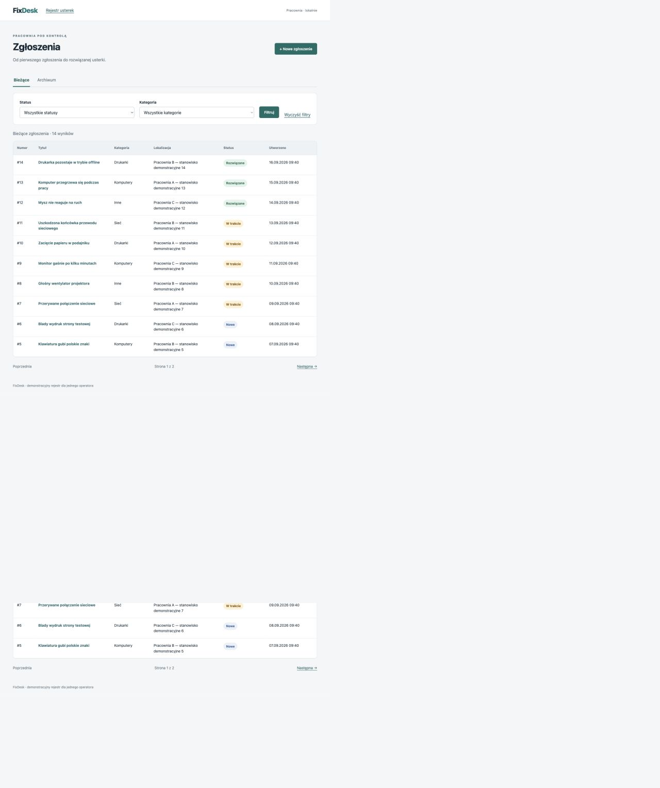
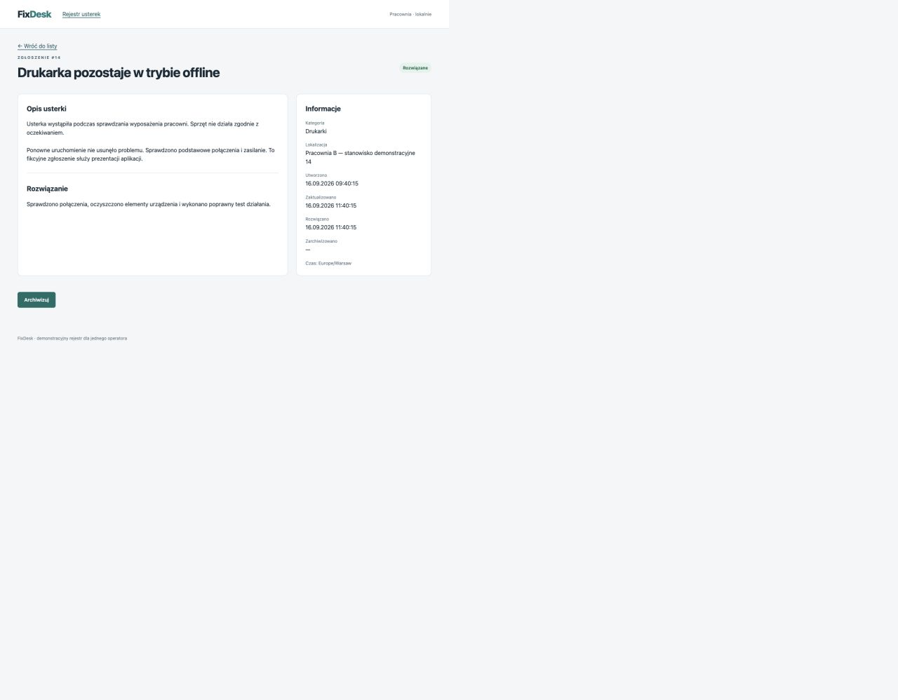

# FixDesk

Lokalny rejestr usterek sprzętu dla jednego operatora pracowni komputerowej.

Proces: **Nowe → W trakcie → Rozwiązane → Archiwizacja**. Rozwiązanie wymaga opisu naprawy. Archiwizacja zachowuje zgłoszenie i udostępnia je do odczytu.

## Funkcje i zrzuty ekranu

- Dodawanie zgłoszeń, podgląd szczegółów i edycja otwartych zgłoszeń.
- Rozpoczynanie obsługi, zapisywanie rozwiązania i archiwizacja.
- Lista bieżąca i archiwum, łączne filtrowanie po statusie i kategorii oraz paginacja po 10 rekordów.
- Walidacja formularzy i komunikaty po polsku; daty wyświetlane w strefie Europe/Warsaw.
- Dane demonstracyjne: 4 kategorie i 16 fikcyjnych zgłoszeń, w tym 2 archiwalne.

Lista zgłoszeń:



Szczegóły rozwiązanego zgłoszenia:



## Technologie i wymagania

PHP **8.4.x** (ograniczenie `~8.4.0` w `composer.json`), Composer **2** i MySQL **8.4**. `composer.lock` przypina Laravel **13.33.0** oraz PHPUnit **12.5.35**. Interfejs korzysta z Blade, własnego CSS i systemowych fontów; nie wymaga Node.js ani kompilacji frontendu.

Rozszerzenia PHP: ctype, curl, dom, fileinfo, filter, hash, mbstring, openssl, pcre, PDO, pdo_mysql, session, tokenizer, xml i xmlwriter; iconv i zip są zalecane. Wymagania pakietów sprawdza `composer check-platform-reqs`. Katalogi `storage/` i `bootstrap/cache/` muszą być zapisywalne. Sieć jest potrzebna do pobrania zależności.

## Pierwsze uruchomienie

1. Zainstaluj PHP 8.4, Composer i MySQL 8.4 oraz uruchom serwer MySQL. Na macOS z Homebrew:

   ```sh
   brew install php@8.4 composer mysql@8.4
   export PATH="$(brew --prefix php@8.4)/bin:$(brew --prefix mysql@8.4)/bin:$PATH"
   brew services start mysql@8.4
   php -v
   composer --version
   ```

   Na innych systemach użyj odpowiednich instalatorów. Upewnij się, że `php -v` wskazuje PHP 8.4, także w terminalu używanym do testów.

2. Pobierz projekt i zależności, a następnie utwórz lokalną konfigurację:

   ```sh
   git clone https://github.com/JakubLewosz/FixDesk.git FixDesk
   cd FixDesk
   composer install
   composer check-platform-reqs
   cp .env.example .env
   ```

3. W kliencie MySQL jako administrator utwórz nowe bazy i lokalne konto. Zastąp przykładowe hasło własnym i nie dodawaj go do Git:

   ```sql
   CREATE DATABASE fixdesk CHARACTER SET utf8mb4 COLLATE utf8mb4_unicode_ci;
   CREATE DATABASE fixdesk_test CHARACTER SET utf8mb4 COLLATE utf8mb4_unicode_ci;
   CREATE USER 'fixdesk'@'127.0.0.1' IDENTIFIED BY 'WPISZ_WLASNE_HASLO';
   GRANT ALL PRIVILEGES ON fixdesk.* TO 'fixdesk'@'127.0.0.1';
   GRANT ALL PRIVILEGES ON fixdesk_test.* TO 'fixdesk'@'127.0.0.1';
   ```

4. W `.env` ustaw `DB_HOST=127.0.0.1`, port swojego serwera (domyślnie `3306`), `DB_DATABASE=fixdesk` oraz nazwę użytkownika i hasło. Pozostaw `SESSION_DRIVER=file`, `CACHE_STORE=file`, `QUEUE_CONNECTION=sync` i `APP_DEBUG=false`.

5. Wygeneruj klucz i sprawdź bazę przed migracją:

   ```sh
   php artisan key:generate
   php artisan config:clear
   php artisan db:show
   ```

   Po potwierdzeniu połączenia `mysql` i bazy `fixdesk` utwórz tabele, wczytaj dane demonstracyjne i uruchom serwer:

   ```sh
   php artisan migrate
   php artisan db:seed
   php artisan serve --host=127.0.0.1 --port=8000
   ```

   Otwórz [FixDesk lokalnie](http://127.0.0.1:8000). Seeder działa tylko na jawne polecenie. Ponowne `db:seed` uzupełnia brakujące kategorie, ale nie dodaje ponownie zgłoszeń demonstracyjnych, jeśli istnieją już jakiekolwiek zgłoszenia.

## Ponowne uruchomienie

Uruchom MySQL i w katalogu projektu, z PHP 8.4 w `PATH`, wykonaj:

```sh
php artisan serve --host=127.0.0.1 --port=8000
```

Nie generuj ponownie klucza ani nie resetuj bazy. Migracje i seeder nie są potrzebne przy każdym starcie. Po zmianie `.env` wykonaj `php artisan config:clear`. Serwer aplikacji zatrzymasz przez Ctrl+C.

## Testy

Testy wymagają oddzielnej bazy MySQL **fixdesk_test**, utworzonej podczas instalacji. Przy pierwszej konfiguracji testów:

```sh
cp .env.testing.example .env.testing
```

W `.env.testing` ustaw port, użytkownika i hasło do MySQL. Zachowaj `APP_ENV=testing`, `DB_CONNECTION=mysql` i `DB_DATABASE=fixdesk_test`, a następnie wykonaj:

```sh
php artisan key:generate --env=testing
php artisan config:clear
php artisan db:show --env=testing
```

Po potwierdzeniu połączenia `mysql` i bazy `fixdesk_test` uruchom:

```sh
php artisan test
```

**Testy mogą usuwać dane z fixdesk_test — przeznacz tę bazę wyłącznie na testy.** Zabezpieczenie w `tests/TestCase.php` sprawdza środowisko, brak cache konfiguracji, sterownik oraz skonfigurowaną i rzeczywistą nazwę bazy przed uruchomieniem `RefreshDatabase`. Kolejne uruchomienia wymagają tylko działającego MySQL i `php artisan test`.

Dodatkowe sprawdzenia:

```sh
composer validate --strict
composer check-platform-reqs
vendor/bin/pint --test
```

GitHub Actions uruchamia ten sam zestaw testów oraz walidację Composera i Pint po każdym pushu i dla pull requestów do `main`. Workflow [Tests](https://github.com/JakubLewosz/FixDesk/actions/workflows/tests.yml) używa PHP 8.4 i osobnej bazy `fixdesk_test` w jednorazowym MySQL 8.4; nie wymaga sekretów ani Dockera przy lokalnym uruchamianiu. Można go także uruchomić ręcznie.

## Przykładowe użycie

1. Na liście wybierz **+ Nowe zgłoszenie**, wypełnij tytuł, kategorię, lokalizację i opis usterki, a następnie zapisz.
2. W szczegółach możesz poprawić otwarte zgłoszenie przez **Edytuj**. Wybierz **Rozpocznij obsługę**, aby przejść do statusu **W trakcie**.
3. Wpisz opis naprawy (10–2000 znaków) i wybierz **Zapisz rozwiązanie**. Szczegóły pokażą opis oraz datę rozwiązania.
4. Wybierz **Archiwizuj**. Zgłoszenie znajdziesz w zakładce **Archiwum**, gdzie pozostaje dostępne do odczytu.
5. Na liście użyj filtrów statusu i kategorii oraz przycisku **Filtruj**. Przy większej liczbie wyników przechodź między stronami, zachowując wybrane filtry.

## Ograniczenia

Aplikacja jest **lokalnym demo dla jednego operatora**, bez uwierzytelniania i kontroli dostępu między użytkownikami. **Nie powinna być publicznie udostępniana w obecnej postaci.** Nie jest wdrożeniem produkcyjnym i nie przeszła zewnętrznego audytu bezpieczeństwa.

Nie obsługuje usuwania zgłoszeń, cofania statusów, przywracania z archiwum, historii zmian, zarządzania kategoriami ani API. Nie zapewnia bezpiecznej równoczesnej pracy wielu operatorów. Rozwiązane i archiwalne zgłoszenia nie podlegają edycji.

## Wykorzystanie AI

Do wygenerowania implementacji, testów i dokumentacji oraz wprowadzania poprawek wykorzystano Codex.
